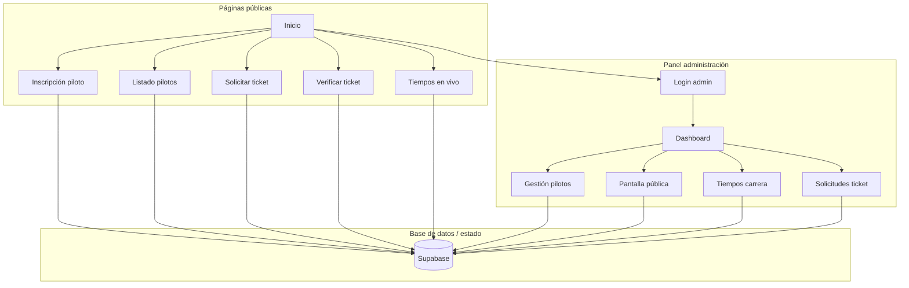
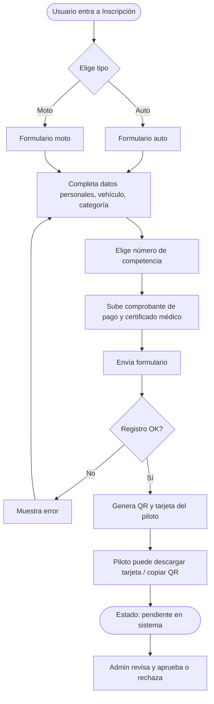
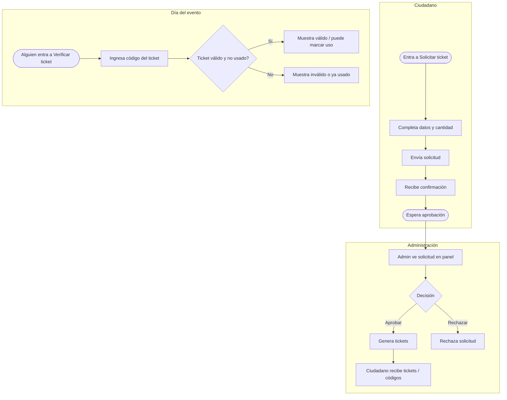
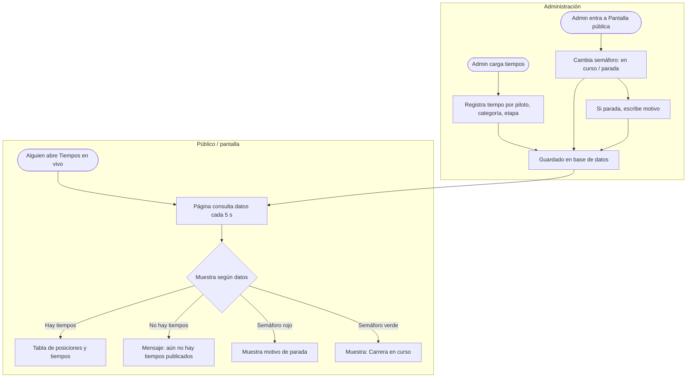
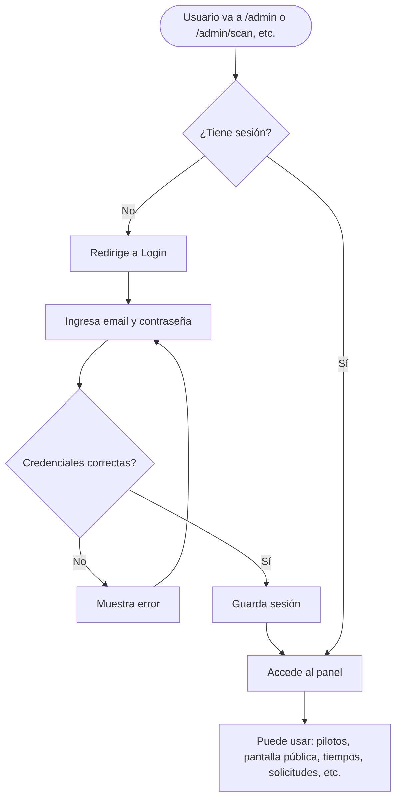
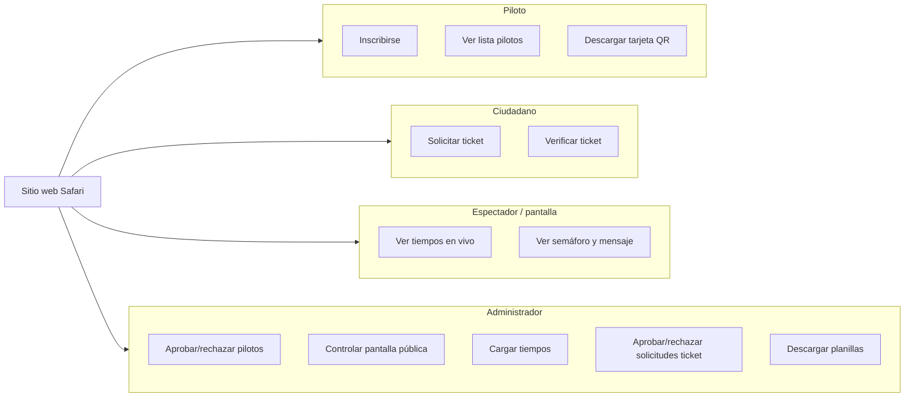

# Diagramas de flujo — Safari Tras las Sierras

Se pueden visualizar en [Mermaid Live](https://mermaid.live) o en cualquier visor que soporte Mermaid (GitHub, Notion, etc.).

---

## 1. Vista general del sistema

---

## 2. Flujo de inscripción del piloto

---

## 3. Flujo de solicitud y verificación de ticket

---

## 4. Flujo de tiempos de carrera y pantalla pública

---

## 5. Flujo de acceso al panel de administración

---

## 6. Resumen de actores y acciones

